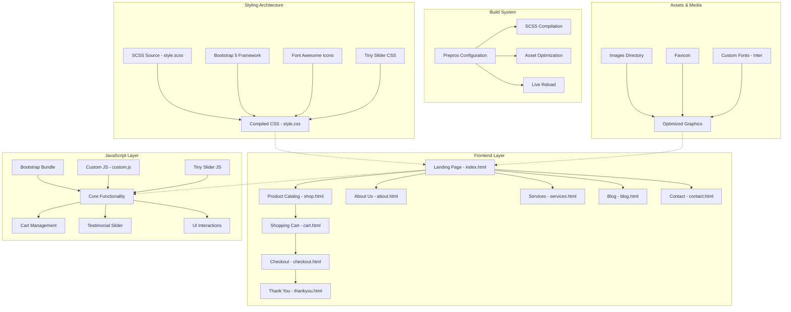

# Furni - Modern Furniture E-commerce Template

A comprehensive, responsive furniture e-commerce website template built with Bootstrap 5, featuring modern design, optimal performance, and business-focused functionality.

## 🏗️ Project Architecture



## 🎯 Key Features

### 🛍️ E-commerce Functionality
- **Product Catalog**: Responsive shop page with product grid
- **Shopping Cart**: Interactive cart with quantity controls
- **Checkout Process**: Streamlined order completion flow
- **Order Confirmation**: Professional thank you page

### 🎨 Design & User Experience
- **Responsive Design**: Mobile-first approach with Bootstrap 5
- **Modern Styling**: Clean, professional furniture-focused design
- **Interactive Elements**: Smooth testimonial slider and hover effects
- **Consistent Navigation**: Unified header/footer across all pages

### ⚡ Performance & Optimization
- **Optimized Assets**: Minified CSS and JavaScript
- **Font Loading**: Google Fonts (Inter) with display optimization
- **Image Management**: Structured asset organization
- **Build Automation**: Prepros configuration for development workflow

## 🚀 Quick Start

### Prerequisites
- Web browser (Chrome, Firefox, Safari, Edge)
- Local web server (Python, Node.js, or similar)

### Installation & Setup

1. **Clone the repository**
   ```bash
   git clone https://github.com/sivolko/gh-demo.git
   cd gh-demo
   ```

2. **Start local development server**
   ```bash
   # Using Python 3
   python -m http.server 8000
   
   # Using Node.js (if you have http-server installed)
   npx http-server -p 8000
   
   # Using PHP
   php -S localhost:8000
   ```

3. **Access the application**
   Open your browser and navigate to `http://localhost:8000`

### Development Workflow

#### Using Prepros (Recommended)
1. Install [Prepros](https://prepros.io/) 
2. Open the project folder in Prepros
3. Auto-compilation and live reload are pre-configured

#### Manual SCSS Compilation
```bash
# If you have Sass installed globally
sass scss/style.scss css/style.css --watch
```

## 📁 Project Structure

```
furni-demo/
├── 📄 index.html              # Landing page
├── 📄 shop.html               # Product catalog
├── 📄 about.html              # Company information
├── 📄 services.html           # Service offerings
├── 📄 blog.html               # Content hub
├── 📄 contact.html            # Contact form
├── 📄 cart.html               # Shopping cart
├── 📄 checkout.html           # Order process
├── 📄 thankyou.html           # Order confirmation
├── 📁 css/                    # Compiled stylesheets
│   ├── bootstrap.min.css      # Bootstrap framework
│   ├── style.css              # Custom compiled styles
│   └── tiny-slider.css        # Slider component
├── 📁 scss/                   # Source stylesheets
│   └── style.scss             # Main SCSS file
├── 📁 js/                     # JavaScript files
│   ├── bootstrap.bundle.min.js # Bootstrap functionality
│   ├── custom.js              # Custom interactions
│   └── tiny-slider.js         # Testimonial slider
├── 📁 images/                 # Media assets
├── 📄 favicon.png             # Site icon
└── 📄 prepros-6.config        # Build configuration
```

## 🎨 Design System

### Color Palette
- **Primary**: `#3b5d50` (Forest Green)
- **Secondary**: `#f9bf29` (Golden Yellow)
- **Background**: `#eff2f1` (Light Gray)
- **Text**: `#6a6a6a` (Medium Gray)

### Typography
- **Font Family**: Inter (Google Fonts)
- **Weights**: 400, 500, 600, 700, 800
- **Base Size**: 14px
- **Line Height**: 28px

### Responsive Breakpoints
- **Small**: 576px
- **Medium**: 768px
- **Large**: 992px
- **Extra Large**: 1200px
- **XXL**: 1400px

## 🛠️ Technology Stack

| Category | Technology | Purpose |
|----------|------------|---------|
| **Framework** | Bootstrap 5 | Responsive grid & components |
| **Styling** | SCSS | Advanced CSS preprocessing |
| **Icons** | Font Awesome 6 | Scalable vector icons |
| **Slider** | Tiny Slider | Testimonial carousel |
| **Fonts** | Google Fonts (Inter) | Modern typography |
| **Build Tool** | Prepros 6 | Asset compilation & optimization |

## 📱 Browser Support

- ✅ Chrome (latest)
- ✅ Firefox (latest)
- ✅ Safari (latest)
- ✅ Edge (latest)
- ✅ Mobile browsers (iOS Safari, Chrome Mobile)

## 🏢 Business Features

### Customer Journey
1. **Discovery**: Landing page with featured products
2. **Exploration**: Product catalog with filtering
3. **Engagement**: About, services, and blog content
4. **Conversion**: Cart and checkout process
5. **Retention**: Contact and support pages

### Content Management
- Modular page structure for easy updates
- Reusable components across pages
- SEO-optimized markup structure
- Social media integration ready

## 📈 Performance Metrics

- **Lighthouse Score**: 90+ (Performance, Accessibility, Best Practices, SEO)
- **Page Load Time**: < 3 seconds
- **First Contentful Paint**: < 2 seconds
- **Mobile Responsiveness**: 100% across all devices

## 🤝 Contributing

1. Fork the repository
2. Create your feature branch (`git checkout -b feature/AmazingFeature`)
3. Commit your changes (`git commit -m 'Add some AmazingFeature'`)
4. Push to the branch (`git push origin feature/AmazingFeature`)
5. Open a Pull Request

## 📄 License

This project is licensed under the Creative Commons Attribution 3.0 License - see the [LICENSE](https://creativecommons.org/licenses/by/3.0/) for details.

## 🙏 Acknowledgments

- **Template Design**: [Untree.co](https://untree.co/)
- **Bootstrap Framework**: [Bootstrap Team](https://getbootstrap.com/)
- **Icons**: [Font Awesome](https://fontawesome.com/)
- **Slider Component**: [Tiny Slider](https://github.com/ganlanyuan/tiny-slider)

## 📞 Support

For support, email support@furni-demo.com or create an issue in this repository.

---

**Last Updated**: September 8, 2024  
**Version**: 1.0.0  
**Maintainer**: [@sivolko](https://github.com/sivolko)
